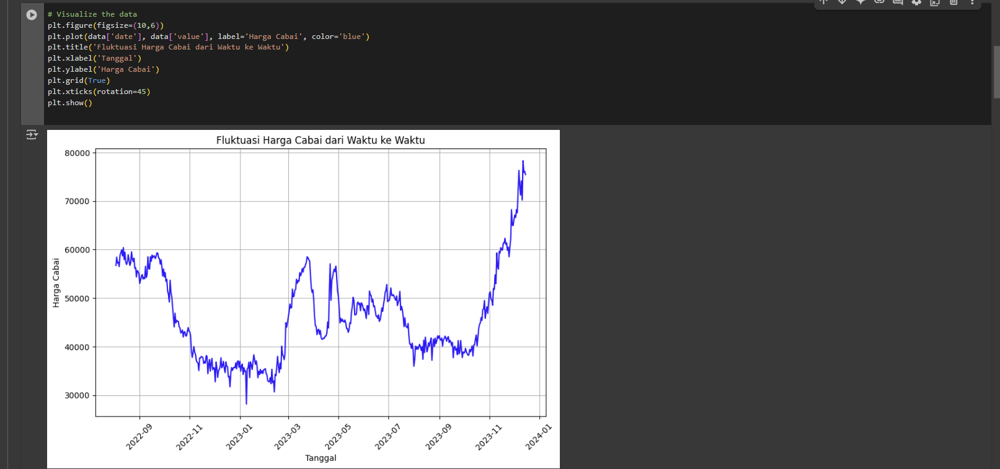
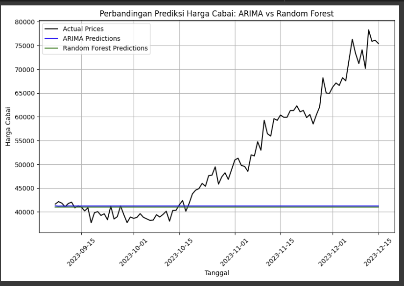

# Laporan Proyek Machine Learning- Tazky Khumaira Tsany
## Domain Proyek

**Latar Belakang**
Harga cabai adalah salah satu komoditas pangan yang dapat memengaruhi tingkat inflasi. Ketidakstabilan harga cabai, yang seringkali menunjukkan tren kenaikan dalam periode tertentu, dapat berdampak negatif bagi negara dan masyarakat.
Cabai juga termasuk dalam salah satu komoditas hortikultura unggulan nasional. Berdasarkan data dari Survei Sosial Ekonomi Nasional (SUSENAS), konsumsi cabai rawit secara agregat pada tahun 2013 mencapai 316,57 ribu ton per tahun, dan mengalami kenaikan pada tahun 2014 menjadi 318,21 ribu ton per tahun. Kebutuhan akan cabai ini diperkirakan akan terus meningkat seiring berjalannya waktu.

Pada prediksi harga cabai ini, saya menggunakan data harga cabai dengan dataset yang terdiri dari 500 baris dan 2 kolom, yang mencakup dua variabel: satu yang mewakili waktu (seperti tanggal/periode) dan satu lagi yang menunjukkan harga cabai. Fluktuasi harga cabai yang sering terjadi dapat mempengaruhi kestabilan pasar dan daya beli masyarakat, terutama di kalangan konsumen dengan pendapatan rendah. 

Dengan menggunakan dataset ini, diharapkan dapat dilakukan prediksi yang lebih akurat untuk mengantisipasi perubahan harga, serta membantu dalam perencanaan distribusi dan kebijakan yang lebih efisien di sektor pangan
 

### Refrensi
Hadiansyah, F. N. (2017). Prediksi Harga Cabai dengan Menggunakan Pemodelan Time Series ARIMA. Indonesian Journal of Computing. 
https://socjs.telkomuniversity.ac.id/ojs/index.php/indojc/article/view/144

Susanti, L., Pririzki, S. J., Zeleansi, Z., & Dalimunthe, D. Y. (tahun). Prediksi Harga Cabai Rawit Merah Sebagai Kebutuhan Pangan Masyarakat di Kota Pangkalpinang.


## Business Understanding
Bagian ini menjelaskan proses klarifikasi masalah dalam proyek prediksi harga cabai, yang berfokus pada analisis data historis harga Cabai Merah Keriting di Sultra dan pengembangan model prediksi untuk mendukung pengambilan keputusan.

### Problem Statement
1. Prediksi harga cabai di masa depan berdasarkan data historis sangat penting untuk membantu masyarakat dan pelaku pasar dalam merencanakan kegiatan ekonomi mereka. Saat ini, belum ada sistem yang dapat memprediksi harga cabai secara akurat dalam jangka pendek menggunakan data historis yang tersedia.

2. Pola musiman dan tren yang memengaruhi harga cabai perlu diidentifikasi untuk mengetahui faktor-faktor yang memengaruhi fluktuasi harga. Belum ada metode yang efektif untuk menganalisis pola musiman atau tren harga cabai secara menyeluruh, yang menyebabkan pengambilan keputusan yang seringkali reaktif dan kurang tepat.

### Goals
1. Membangun model prediksi harga cabai berbasis ARIM dan Random Forest untuk memperikaran prediksi yang baik.
2. Mengidentifikasi dan memnganalisi  faktor yang memengaruhi fluktuasi harga cabai untuk pengambilan keputusan yang lebih baik.

### Solusion Statements

1. Membangun model ARIMA (Autoregressive Integrated Moving Average) untuk memprediksi harga cabai berdasarkan data historis.
2. Menggunakan model Random Forest untuk menangkap pola dan memprediksi harga, dengan tuning hyperparameter untuk meningkatkan akurasi.
3.  Membandingkan hasil antara model ARIMA dan Random Forest untuk mengetahui model dengan performa yang terbaik dari data harga cabai di Sultra

# Data Understanding 
| Date       | Value |
|------------|-------|
| 2022-08-03 | 56700 |
| 2022-08-04 | 58430 |
| 2022-08-05 | 57200 |
| 2022-08-06 | 57380 |
| 2022-08-07 | 56480 |

Dataset yang digunalan dalam proyek ini bersumber dari platfom Kaggle https://www.kaggle.com/datasets/muhvannesalqadri/data-harga-jual-cabai-merah-keriting-di-sultra Dataset ini terdiri dari 500 baris dan 2 kolom. Kolom pertama berisi tanggal dan kolom kedua berisi nilai harga cabai.

### Struktur Dataset
Dataset ini terdiri dari 2 kolom sebagai berikut:
 1. date: Kolom ini berisi tanggal dengan format DD-MM-YY.
 2. value: Kolom ini berisi nilai yang sesuai dengan setiap tanggal, yang diwakili dalam bentuk      angka bulat.

  ### Informasi Tambahan
 - Jumlah Baris: 500 baris data.
 - Jumlah Kolom: 2 kolom data.
 - Tipe Data: Kolom date berisi data bertipe string (tanggal)
 -  kolom value berisi data bertipe integer (nilai harga).
 - Periode Data: Data ini mencakup rentang waktu dari  data fluktuasi harga cabai dari sekitar     bulan Agustus 2022 hingga Desember 2023

### Target Prediksi 
Kolom harga merupakan target prediksi untuk model ini yaitu pada model ARIMA dan Random Forest,yang merujuk pada harga cabai dalam peradangan di Sultra

### Variabel Penting

Berdasarkan dataset  ada dua kolom yang menjadi variabel penting yaitu:
 - date: Kolom ini berisi informasi tentang tanggal (format DD-MM-YY).
 - value: Kolom ini berisi nilai yang mewakili harga cabai pada setiap tanggal yang tercatat.


Pada gambar dibawah ini terlihat bahwa Grafik berikut menunjukkan fluktuasi harga cabai dari bulan Agustus 2022 hingga Desember 2023. Terlihat adanya kecenderungan kenaikan harga pada periode menjelang hari raya besar



## Data Preparation

Pada tahap ini, beberapa langkah  dilakukan untuk mempersiapkan data agar siap digunakan oleh algoritma pembelajaran mesin. Berikut adalah langkah-langkah yang diambil dalam proses persiapan data:

### 1. Pra-pemrosesan data
data dibagi menjadi dua bagian, yaitu data pelatihan dan data pengujian, di mana ukuran data dapat dihitung dan dataframe dibagi sesuai dengan proporsi yang ditentukan
```
# Membagi dataset menjadi data pelatihan dan pengujian
train_size = int(len(data) * 0.8)  # 80% untuk data pelatihan
train, test = data[:train_size], data[train_size:]

# Menggunakan kolom 'value' sebagai variabel target (variabel dependen)
X_train = np.array(range(len(train))).reshape(-1, 1)  # Membuat fitur untuk data pelatihan
y_train = train['value']  # Nilai target untuk data pelatihan

X_test = np.array(range(len(train), len(data))).reshape(-1, 1)  # Membuat fitur untuk data pengujian
y_test = test['value']  # Nilai target untuk data pengujian
```


### 2. Mengatur 'date' sebagai indeks
Kode ini mengambil data historis harga cabai dan mengatur kolom ` date` sebagai indeks dari dataset, menunjukkan fokus pada analisis dan prediksi harga ` value ` berdasarkan tanggal.
```
if 'date' in data.columns:
    data.set_index('date', inplace=True)

display(data.head())
```

### 3. Mengatur frekuensi ke harian
Kode ini memastikan bahwa dataset harga cabai memiliki frekuensi harian ` D ` dengan mengisi tanggal yang hilang
```
data = data.asfreq('D')
display(data.head())
```

### 4. Menangani nilai yang hilang
Kode ini menangani nilai-nilai yang hilang (NaN) pada kolom harga ` value`  dengan melakukan interpolasi linear
```
# Menangani nilai yang hilang (NaNs)
data['value'] = data['value'].interpolate(method='linear')
```

 
# Modeling
Dalam proyek ini menggunakan 2 model untuk memeprediksi Harga Cabai Merah Keriting di Sultra

## Model 1: ARIMA

Model ARIMA (Autoregressive Integrated Moving Average) digunakan dalam analisis deret waktu (time series) untuk memprediksi nilai di masa depan berdasarkan data historis

Cara Kerja:

1. Membagi data menjadi set pelatihan dan penguji

Pada kode ini membagi dataset harga cabai yang telah dipersiapkan menjadi data pelatihan  dan data pengujian  untuk mempersiapkan tahap pelatihan dan evaluasi model.
```
train_size = int(len(data) * 0.8)
train, test = data[:train_size], data[train_size:]

display(train.head())  # Menampilkan beberapa baris pertama dari data pelatihan
display(test.head())   # Menampilkan beberapa baris pertama dari data pengujian
```


| Date       | Value |
|------------|-------|
| 2022-08-03 | 56700 |
| 2022-08-04 | 58430 |
| 2022-08-05 | 57200 |
| 2022-08-06 | 57380 |
| 2022-08-07 | 56480 |
| 2023-09-07 | 41640 |
| 2023-09-08 | 42160 |
| 2023-09-09 | 41840 |
| 2023-09-10 | 41090 |
| 2023-09-11 | 41770 |


2. Membangun dan melatih model ARIMA

Pada kode ini membangun dan melatih model ARIMA (Autoregressive Integrated Moving Average) untuk data pelatihan harga cabai Anda dengan urutan `(5, 1, 0) ` di mana model ini akan menangkap ketergantungan harga saat ini pada lima harga sebelumnya` (p=5)` mempertimbangkan satu tingkat differencing untuk stasionaritas `(d=1)` , dan tidak menggunakan komponen moving average ` (q=0)`, kemudian menampilkan ringkasan statistik model yang terlatih.
```
arima_model = ARIMA(train['value'], order=(5, 1, 0))  # ARIMA(p,d,q)
arima_model_fit = arima_model.fit()

print(arima_model_fit.summary())  # Menampilkan ringkasan model
```

3. Membuat prediksi dan mengevaluasi model

Pada Kode menggunakan model ARIMA yang sudah dilatih untuk memperkirakan harga cabai pada periode uji, kemudian menghitung seberapa bagus perkiraan itu menggunakan ukuran MAE, RMSE, dan R2.

```
# Membuat prediksi menggunakan model ARIMA (perkiraan untuk panjang set pengujian)
arima_pred = arima_model_fit.forecast(steps=len(test))

# Mengevaluasi model ARIMA
mae_arima = mean_absolute_error(test['value'], arima_pred)
rmse_arima = np.sqrt(mean_squared_error(test['value'], arima_pred))
r2_arima = r2_score(test['value'], arima_pred)

print(f"MAE Model ARIMA: {mae_arima}")
print(f"RMSE Model ARIMA: {rmse_arima}")
print(f"R2 Model ARIMA: {r2_arima}")
```

Kelebihan: Baik untuk data time series dengan pola jelas.

Kekurangan: Membutuhkan data stasioner, pemilihan parameter bisa rumit.


## Model 2: Random Forest

Random Forest digunakan untuk memprediksi harga cabai karena kemampuannya menangani data non-linear dan kompleks, serta robust terhadap overfitting 
Cara Kerja:

1. Persiapan data Random Forest

Pada kode ini memberikan nomor urut pada setiap tanggal di data pelatihan dan pengujian agar model Random Forest bisa menggunakan angka ini untuk mengenali pola berdasarkan waktu.
```
# Membuat kolom 'date_num' untuk merepresentasikan waktu sebagai angka
train.loc[:, 'date_num'] = np.arange(len(train))
test.loc[:, 'date_num'] = np.arange(len(train), len(data))

display(train.head()) # Menampilkan data train
display(test.head()) # Menampilkan data tes
```

2. Mendefinisikan hyperparameter dan GridSearchCV

Pada kode ini  menyiapkan  pengaturan (hyperparameter) untuk model Random Forest, lalu menggunakan GridSearchCV untuk mencoba kombinasi pengaturan tersebut secara otomatis untuk menemukan yang terbaik dalam memprediksi harga cabai.
```
# Mendefinisikan rentang hyperparameter untuk GridSearchCV
param_grid = {
    'n_estimators': [50, 100, 150],
    'max_depth': [10, 20, 30],
    'min_samples_split': [2, 5, 10]
}
```
```
# Membuat model Random Forest dan melakukan GridSearchCV
rf_grid = GridSearchCV(RandomForestRegressor(random_state=42), param_grid, cv=5, scoring='neg_mean_squared_error')
```

3. Melatih model Random Forest

Pada kode ini melatih model Random Forest yang sudah disiapkan untuk mencari pengaturan terbaiknya menggunakan data pelatihan, di mana model belajar memprediksi harga cabai ` value ` berdasarkan nomor urut tanggal `date_num`.

```
# Melatih model menggunakan data pelatihan dan kolom 'date_num' sebagai fitur
rf_grid.fit(train[['date_num']], train['value'])

```

```
# Memastikan kolom 'value' ada dalam DataFrame train
if 'value' in train.columns:
    rf_grid.fit(train[['date_num']], train['value'])  # Jika kolom 'value' ada, latih model dengan data pelatihan
else:
    # Jika kolom 'value' tidak ada, coba gunakan data asli
    rf_grid.fit(data[['date_num']], data['value'])  # Latih model menggunakan data lengkap jika kolom 'value' hilang
```


4. Membuat prediksi dan mengevaluasi model Random Forest

Pada kde ini n untuk memprediksi harga cabai pada periode pengujian, lalu mengukur seberapa tepat prediksi tersebut dibandingkan harga aslinya menggunakan `  MAE` , ` RMSE` , dan ` R2` .

```
# Membuat prediksi pada data pengujian
rf_pred = rf_grid.best_estimator_.predict(test[['date_num']])

# Mengevaluasi model Random Forest
mae_rf = mean_absolute_error(test['value'], rf_pred)
rmse_rf = np.sqrt(mean_squared_error(test['value'], rf_pred))
r2_rf = r2_score(test['value'], rf_pred)
``` 


Kelebihan: Akurat, fleksibel, dan mencegah overfitting.

Kekurangan: Komputasi bisa berat, kurang mudah diinterpretasi.5. Kesimpulan dan Evaluation

## Evaluasi Model:
### 1. Metrik Evalusi 

Untuk mengukur kinerja pada masing-masing model prediksi harga cabai,digunakan tiga metriks evalusi yang relevan dengan prediksi nilai harga,yaitu

- MAE (Mean Absolute Error): Mengukur rata-rata selisih absolut antara nilai prediksi dan nilai aktual.
``` 
mae_rf = mean_absolute_error(test['value'], rf_pred)
```

-  RMSE (Root Mean Squared Error): Mengukur akar kuadrat dari rata-rata selisih kuadrat antara nilai prediksi dan nilai aktual.
``` 
rmse_rf = np.sqrt(mean_squared_error(test['value'], rf_pred))
``` 

-   R-squared (R2): Mengukur seberapa baik model cocok dengan data, dengan nilai mendekati 1 menunjukkan kesesuaian yang baik.
``` 
r2_rf = r2_score(test['value'], rf_pred)
``` 

- Visualisai Perbandingan prediksi harga cabai dengan meyode Arima dan Random Forest



Grafik ini menunjukkan perbandingan antara harga cabai yang sebenarnya dengan prediksi menggunakan dua model, yaitu ARIMA dan Random Forest. Model ARIMA menunjukkan hasil yang lebih stabil, sementara prediksi Random Forest tidak mengikuti perubahan harga cabai dengan baik.


### 2. Hasil Evaluasi Model

| Model            | MAE       | RMSE      | R²       |
|------------------|-----------|-----------|----------|
| **ARIMA**        | 10,957.42 | 15,505.54 | -0.6628  |
| **Random Forest**| 11,051.14 | 15,458.87 | -0.6958  |


 ### Analisi Hasil

Model ARIMA menunjukkan kinerja yang lebih baik dibandingkan Random Forest dengan MAE sebesar 10,957.42, RMSE 15,505.54, dan R² -0.6628. Meskipun hasilnya belum optimal, ARIMA lebih stabil dalam memprediksi harga cabai dan memiliki kesalahan prediksi yang sedikit lebih rendah dibandingkan dengan Random Forest.


## Hubungan dengan Business Understanding:

### Apakah sudah menjawab Problem Statements?

- **Problem 1** :Bagaimana memprediksi harga cabai di masa depan berdasarkan data historis? ✅
*Model ARIMA dan Random Forest yang Anda bangun telah menjawab problem statement ini dengan memberikan prediksi harga cabai di masa depan. Akurasi prediksi dapat dinilai dari nilai MAE, RMSE, dan R2.*

- **Problem 2** : Bagaimana mengidentifikasi pola musiman atau tren yang memengaruhi harga cabai?✅
*Model ARIMA secara inheren dapat mengidentifikasi pola musiman dan tren dalam data time series. Visualisasi data dan analisis residual juga dapat membantu dalam mengidentifikasi pola-pola ini.*

### Apakah sudah mencapai Goals? 
- **Goal 1 ** : Membangun model prediksi harga cabai yang akurat.✅
*Telah mencapai tujuan ini dengan membangun dan mengevaluasi dua model prediksi. Nilai MAE, RMSE, dan R2 menunjukkan tingkat akurasi model. Semakin rendah MAE dan RMSE, dan semakin tinggi R2, semakin akurat model tersebut.* 

- **Goal 2 ** : Mengidentifikasi faktor yang memengaruhi fluktuasi harga cabai untuk pengambilan keputusan yang lebih baik.✅
*Model yang dibangun, terutama ARIMA, dapat membantu dalam mengidentifikasi faktor-faktor yang memengaruhi harga cabai.*

### Apakah solusi yang dirancang berdampak? 
-  *Membangun model ARIMA (Autoregressive Integrated Moving Average) untuk memprediksi harga cabai berdasarkan data historis berdampak karena ARIMA adalah model yang cocok untuk data time series dan dapat memberikan prediksi yang baik dan Random Forest untuk menangkap pola dan memprediksi harga, dengan tuning hyperparameter untuk meningkatkan akurasii ini juga berdampak karena Random Forest adalah model yang fleksibel dan akurat. Tuning hyperparameter membantu mengoptimalkan performa model.*


### Kesimpulan Evaluasi
Penggunaan model ARIMA efektif untuk memprediksi harga cabai berdasarkan data time series, dengan kemampuan memberikan prediksi yang baik. Sementara itu, Random Forest yang dilengkapi dengan tuning hyperparameter juga memberikan solusi yang fleksibel dan akurat dalam menangkap pola dan meningkatkan akurasi prediksi harga.

### Refrensi

Hadiansyah, F. N. (2017). Prediksi Harga Cabai dengan Menggunakan Pemodelan Time Series ARIMA. Indonesian Journal of Computing.

Susanti, L., Pririzki, S. J., Zeleansi, Z., & Dalimunthe, D. Y. (tahun). Prediksi Harga Cabai Rawit Merah Sebagai Kebutuhan Pangan Masyarakat di Kota Pangkalpinang.
